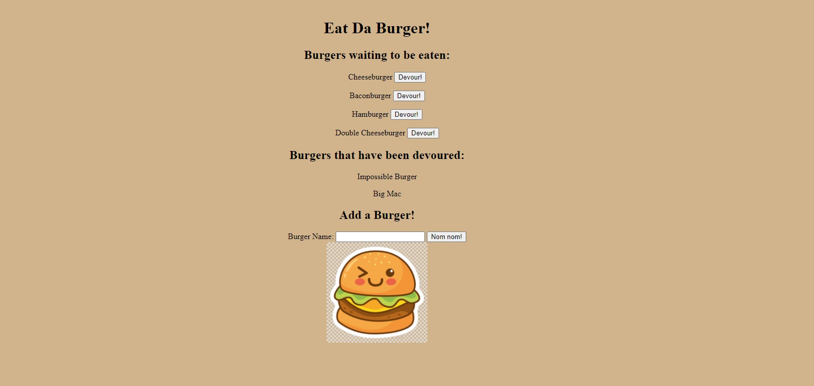

# MVC

## Table of Contents
1. [Description](#description)
2. [Installation](#installation-instructions)
3. [Usage](#usage-information)
4. [Contribution](#contribution-guidelines)
5. [Test](#test-instructions)
6. [Questions & Contact](#questions?-contact-information-below)
### Description
This app is designed to show burgers that are ready to be eaten and then burgers that have been eaten. This app displays how orms and handlebars work together to create a page.

### Installation Instructions
Download all files and properly install through npm. 
### Usage Information
Use "node server" to start the questions for the template.
### Contribution Guidelines
See contact information
### Test Instructions
"node server"
### Questions and Contact Information Below
#### Github Username: crystalcrandall92
#### Github Link: https://github.com/crystalcrandall92
#### Email: crystalcrandall92@yahoo.com

